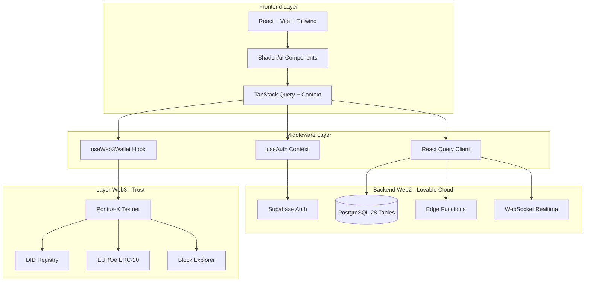
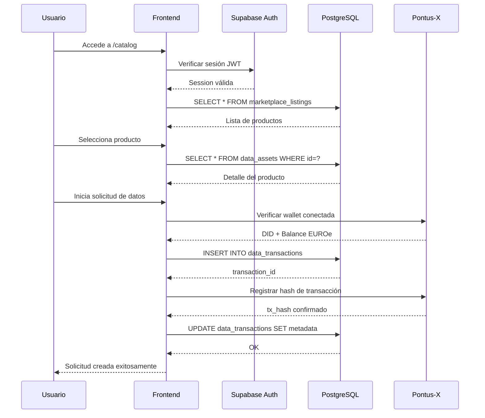
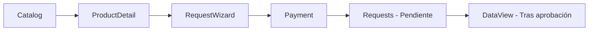
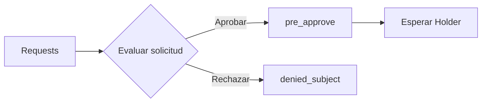
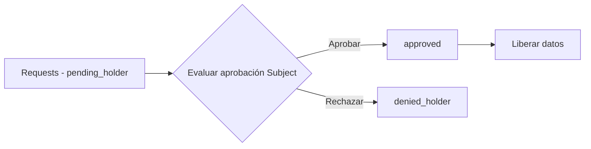
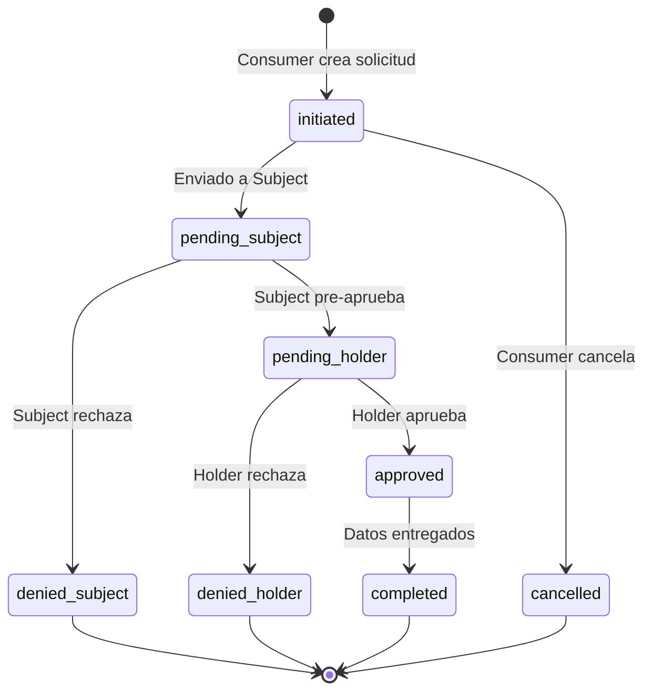
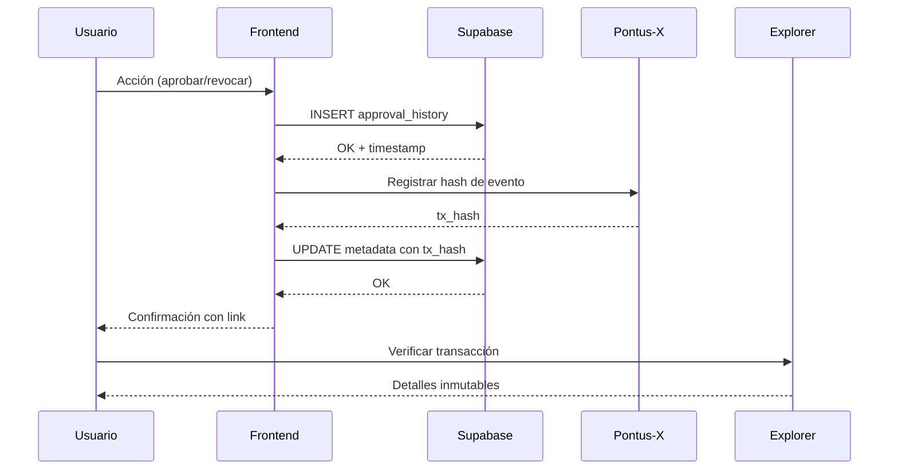
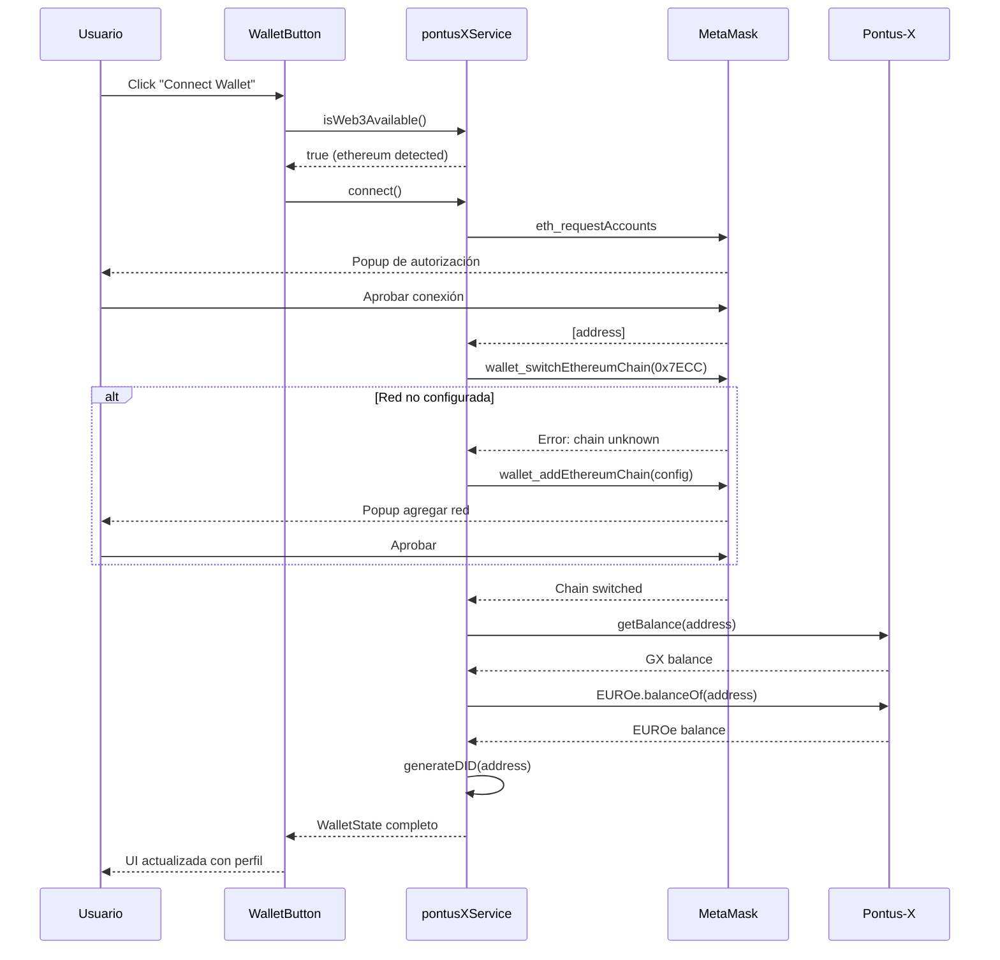
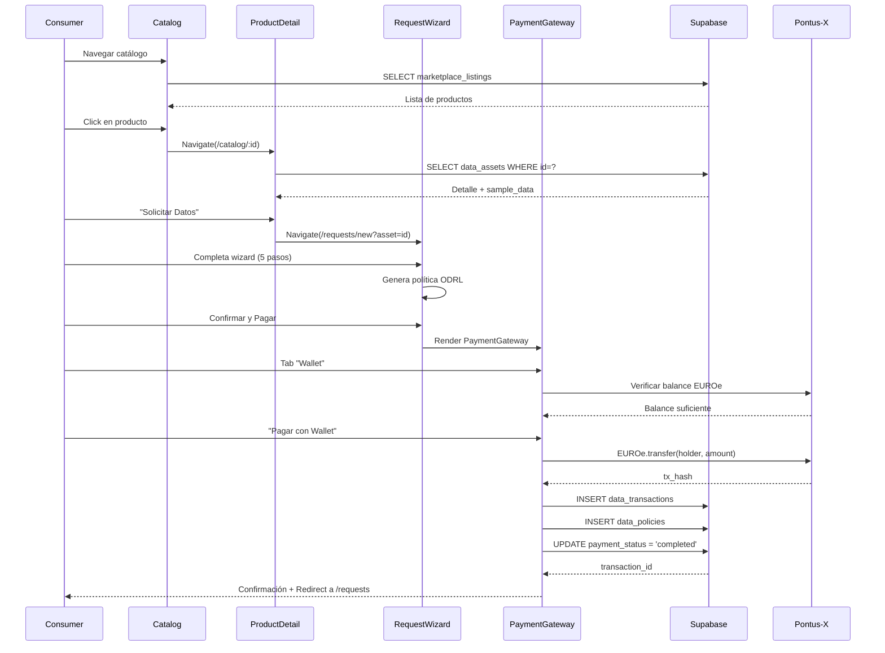
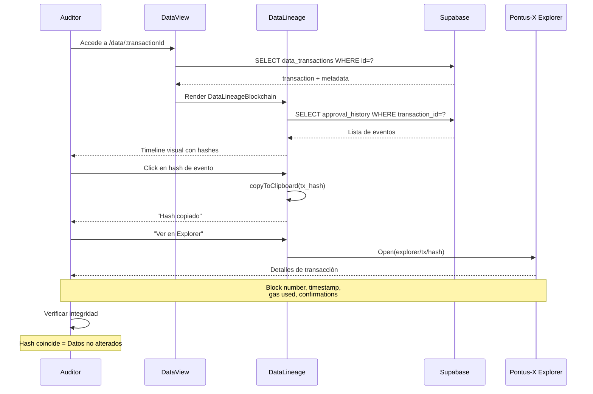

# DOCUMENTO TÉCNICO - PROCUREDATA v3.0

## Plataforma de Soberanía de Datos para Cadenas de Suministro

**Versión:** 3.0  
**Fecha de Actualización:** Enero 2026  
**Clasificación:** Documentación Técnica Interna  

---

## Índice

1. [Visión General del Sistema](#1-visión-general-del-sistema)
2. [Arquitectura de la Plataforma](#2-arquitectura-de-la-plataforma)
3. [Componentes del Espacio de Datos (Gaia-X)](#3-componentes-del-espacio-de-datos-gaia-x)
4. [Catálogo de Componentes Técnicos](#4-catálogo-de-componentes-técnicos)
5. [Interfaces y Páginas Principales](#5-interfaces-y-páginas-principales)
6. [Personas de Usuario (Roles Técnicos)](#6-personas-de-usuario-roles-técnicos)
7. [Modelo de Gobernanza Técnica](#7-modelo-de-gobernanza-técnica)
8. [Seguridad y Auditoría](#8-seguridad-y-auditoría)
9. [Casos de Uso Principales](#9-casos-de-uso-principales)
10. [Anexos](#10-anexos)

---

## 1. Visión General del Sistema

### 1.1 Propósito

PROCUREDATA es una **plataforma de soberanía de datos** diseñada para facilitar el intercambio seguro y trazable de información empresarial entre organizaciones de la cadena de suministro. La plataforma implementa los principios del ecosistema **Gaia-X** y el estándar **IDSA (International Data Spaces Association)** para garantizar:

- **Soberanía de Datos**: Los propietarios de los datos mantienen control total sobre quién accede a su información y bajo qué condiciones.
- **Trazabilidad Inmutable**: Cada acceso y transacción queda registrado en blockchain, creando un historial auditable.
- **Interoperabilidad**: Compatibilidad con sistemas ERP existentes (SAP, Oracle, Salesforce) mediante conectores estandarizados.
- **Cumplimiento Normativo**: Diseñado para satisfacer requisitos GDPR, CSRD, y regulaciones sectoriales.

### 1.2 Modelo Tripartito de Roles

PROCUREDATA implementa un modelo de tres roles fundamentales basado en el estándar IDSA:

```
┌─────────────────┐     ┌─────────────────┐     ┌─────────────────┐
│  DATA CONSUMER  │────▶│  DATA SUBJECT   │────▶│  DATA HOLDER    │
│   (Solicitante) │     │   (Propietario) │     │   (Custodio)    │
└─────────────────┘     └─────────────────┘     └─────────────────┘
        │                       │                       │
        │  Solicita acceso      │  Otorga consentimiento│  Libera datos
        │  a datos              │  o lo deniega         │  tras aprobación
        └───────────────────────┴───────────────────────┘
```

| Rol | Responsabilidad | Ejemplo en Cadena de Suministro |
|-----|-----------------|--------------------------------|
| **Data Consumer** | Solicita acceso a datos para un propósito específico | Empresa compradora que necesita validar proveedores |
| **Data Subject** | Propietario original de los datos, decide sobre su uso | Proveedor cuyos datos fiscales se solicitan |
| **Data Holder** | Custodio técnico que almacena y entrega los datos | Agencia tributaria, cámara de comercio, certificadora |

### 1.3 Arquitectura Híbrida Web2 + Web3

PROCUREDATA utiliza una **arquitectura híbrida** que combina:

- **Capa Web2 (Supabase/PostgreSQL)**: Almacenamiento de metadatos, gestión de usuarios, lógica de negocio, y APIs RESTful.
- **Capa Web3 (Pontus-X Blockchain)**: Registro inmutable de transacciones, verificación de identidad (DID), y pagos con tokens EUROe.

```
┌─────────────────────────────────────────────────────────────────┐
│                        USUARIO FINAL                            │
│                   (Navegador Web + MetaMask)                    │
└─────────────────────────────────────────────────────────────────┘
                              │
                              ▼
┌─────────────────────────────────────────────────────────────────┐
│                      FRONTEND (React + Vite)                    │
│  ┌──────────────┐  ┌──────────────┐  ┌──────────────┐          │
│  │   useAuth    │  │ useWeb3Wallet│  │  React Query │          │
│  │   Context    │  │    Hook      │  │    Cache     │          │
│  └──────────────┘  └──────────────┘  └──────────────┘          │
└─────────────────────────────────────────────────────────────────┘
                              │
              ┌───────────────┴───────────────┐
              ▼                               ▼
┌─────────────────────────┐     ┌─────────────────────────┐
│     BACKEND WEB2        │     │      LAYER WEB3         │
│      (Supabase)         │     │     (Pontus-X)          │
│  ┌─────────────────┐    │     │  ┌─────────────────┐    │
│  │   PostgreSQL    │    │     │  │   Ethers.js     │    │
│  │   (28 tablas)   │    │     │  │   v6.16.0       │    │
│  ├─────────────────┤    │     │  ├─────────────────┤    │
│  │  Supabase Auth  │    │     │  │  Token EUROe    │    │
│  │     (JWT)       │    │     │  │   (ERC-20)      │    │
│  ├─────────────────┤    │     │  ├─────────────────┤    │
│  │ Edge Functions  │    │     │  │  DID Registry   │    │
│  │   (Deno)        │    │     │  │ (did:ethr)      │    │
│  ├─────────────────┤    │     │  ├─────────────────┤    │
│  │   Realtime      │    │     │  │  Block Explorer │    │
│  │  (WebSockets)   │    │     │  │  (Verificación) │    │
│  └─────────────────┘    │     │  └─────────────────┘    │
└─────────────────────────┘     └─────────────────────────┘
```

---

## 2. Arquitectura de la Plataforma

### 2.1 Stack Tecnológico Completo

#### Frontend

| Tecnología | Versión | Propósito |
|------------|---------|-----------|
| **React** | 18.3.1 | Biblioteca de UI con hooks y concurrent mode |
| **Vite** | Latest | Bundler y dev server con HMR instantáneo |
| **TypeScript** | 5.x | Tipado estático para seguridad en desarrollo |
| **Tailwind CSS** | 3.x | Utilidades CSS con sistema de diseño tokenizado |
| **Shadcn/ui** | Latest | Componentes accesibles basados en Radix UI |
| **Framer Motion** | 12.23.24 | Animaciones declarativas y transiciones |
| **Lucide React** | 0.462.0 | Iconografía SVG consistente |
| **Recharts** | 2.15.4 | Visualización de datos y gráficos |

#### Estado y Data Fetching

| Tecnología | Versión | Propósito |
|------------|---------|-----------|
| **TanStack Query** | 5.83.0 | Cache, sincronización y estado servidor |
| **React Context** | Built-in | Estado global para auth y preferencias |
| **React Hook Form** | 7.61.1 | Gestión de formularios performante |
| **Zod** | 3.25.76 | Validación de esquemas en runtime |

#### Backend (Lovable Cloud / Supabase)

| Tecnología | Versión | Propósito |
|------------|---------|-----------|
| **PostgreSQL** | 15.x | Base de datos relacional con RLS |
| **Supabase Auth** | Latest | Autenticación JWT con múltiples providers |
| **Edge Functions** | Deno | Serverless functions para lógica backend |
| **Realtime** | WebSockets | Suscripciones a cambios en tiempo real |
| **Storage** | S3-compatible | Almacenamiento de archivos (pendiente) |

#### Layer Web3 (Trust Layer)

| Tecnología | Versión | Propósito |
|------------|---------|-----------|
| **Ethers.js** | 6.16.0 | Interacción con blockchain EVM |
| **Pontus-X Testnet** | Chain 0x7ECC | Red blockchain del ecosistema Gaia-X |
| **MetaMask/Rabby** | Latest | Wallets compatibles Web3 |
| **EUROe Token** | ERC-20 | Stablecoin para pagos en plataforma |
| **DID (did:ethr)** | W3C Standard | Identificadores descentralizados |

#### Utilidades

| Tecnología | Versión | Propósito |
|------------|---------|-----------|
| **date-fns** | 3.6.0 | Manipulación de fechas |
| **jsPDF** | 3.0.4 | Generación de documentos PDF |
| **React Joyride** | 2.9.3 | Tours guiados de onboarding |
| **Sonner** | 1.7.4 | Sistema de notificaciones toast |

### 2.2 Diagrama de Arquitectura de Alto Nivel



### 2.3 Flujo de Datos Principal



---

## 3. Componentes del Espacio de Datos (Gaia-X)

### 3.1 Identidad Soberana (Self-Sovereign Identity - SSI)

PROCUREDATA implementa **Identificadores Descentralizados (DIDs)** siguiendo el estándar W3C DID Core 1.0, específicamente el método `did:ethr` para redes Ethereum-compatibles.

#### Generación de DID

El servicio `pontusXService` genera DIDs automáticamente al conectar una wallet:

```typescript
// src/services/pontusX.ts
generateDID(address: string): string {
  const chainIdHex = PONTUSX_NETWORK_CONFIG.chainId; // 0x7ECC (32460)
  return `did:ethr:${chainIdHex}:${address}`;
}

// Resultado ejemplo:
// did:ethr:0x7ecc:0x742d35Cc6634C0532925a3b844Bc9e7595f8fE00
```

#### Estructura del DID

| Componente | Valor | Descripción |
|------------|-------|-------------|
| Scheme | `did` | Prefijo estándar W3C |
| Method | `ethr` | Método Ethereum DID |
| Network | `0x7ecc` | Chain ID Pontus-X Testnet |
| Identifier | `0x742d...` | Dirección Ethereum de la wallet |

#### Visualización en UI

El componente `WalletButton.tsx` muestra el DID del usuario conectado:

```typescript
// src/components/WalletButton.tsx
<div className="px-2 py-2">
  <p className="text-xs text-muted-foreground mb-1">DID (Decentralized ID)</p>
  <div className="flex items-center gap-2">
    <code className="text-xs bg-muted px-2 py-1 rounded flex-1 truncate">
      {wallet.did}  {/* did:ethr:0x7ecc:0x... */}
    </code>
    <Button variant="ghost" size="icon" onClick={() => copyToClipboard(wallet.did)}>
      <Copy className="h-3 w-3" />
    </Button>
  </div>
</div>
```

### 3.2 Conector de Datos (Data Connector)

El servicio `PontusXService` actúa como el **conector de datos** que facilita la comunicación entre la aplicación y la red blockchain.

#### Clase PontusXService

```typescript
// src/services/pontusX.ts
class PontusXService {
  private provider: ethers.BrowserProvider | null = null;
  private signer: ethers.Signer | null = null;
  private euroeContract: ethers.Contract | null = null;

  // Métodos principales
  async connectWallet(): Promise<WalletState>     // Conexión + switch de red
  disconnect(): void                               // Limpia estado
  async switchNetwork(): Promise<void>            // Fuerza Pontus-X
  async getEUROeBalance(address: string): Promise<string>  // Balance ERC-20
  generateDID(address: string): string            // Genera did:ethr
  async signMessage(message: string): Promise<string>      // Firma SIWE
  async revokeAccess(did: string, resourceId: string): Promise<string>  // Revocación
}

export const pontusXService = new PontusXService();  // Singleton
```

#### Configuración de Red Pontus-X

```typescript
// src/services/pontusX.ts
export const PONTUSX_NETWORK_CONFIG = {
  chainId: '0x7ECC',           // 32460 en decimal
  chainName: 'Pontus-X Testnet',
  nativeCurrency: {
    name: 'GX Token',
    symbol: 'GX',
    decimals: 18,
  },
  rpcUrls: ['https://rpc.test.pontus-x.eu'],
  blockExplorerUrls: ['https://explorer.pontus-x.eu/'],
};
```

#### Token EUROe (ERC-20)

```typescript
// Dirección del contrato (placeholder - actualizar con dirección real)
const EUROE_CONTRACT_ADDRESS = '0x...';

// ABI mínimo para interacción
const ERC20_ABI = [
  'function balanceOf(address owner) view returns (uint256)',
  'function decimals() view returns (uint8)',
  'function symbol() view returns (string)',
  'function transfer(address to, uint256 amount) returns (bool)',
];
```

### 3.3 Catálogo Federado

El catálogo de PROCUREDATA implementa la especificación **DCAT (Data Catalog Vocabulary)** adaptada para espacios de datos industriales.

#### Vista Materializada: marketplace_listings

```sql
-- Vista que combina data_assets, data_products, organizations, y esg_reports
CREATE VIEW marketplace_listings AS
SELECT 
  da.id AS asset_id,
  dp.id AS product_id,
  dp.name AS product_name,
  dp.description AS product_description,
  dp.category,
  dp.version,
  da.price,
  da.currency,
  da.pricing_model,
  da.billing_period,
  o.id AS provider_id,
  o.name AS provider_name,
  o.kyb_verified,
  o.seller_category,
  esg.energy_renewable_percent,
  -- Badges calculados
  (esg.energy_renewable_percent >= 80) AS has_green_badge,
  -- Métricas de reputación
  (SELECT AVG(rating) FROM organization_reviews WHERE target_org_id = o.id) AS reputation_score,
  (SELECT COUNT(*) FROM organization_reviews WHERE target_org_id = o.id) AS review_count
FROM data_assets da
JOIN data_products dp ON da.product_id = dp.id
JOIN organizations o ON da.subject_org_id = o.id
LEFT JOIN esg_reports esg ON o.id = esg.organization_id
WHERE da.is_public_marketplace = true AND da.status = 'active';
```

#### Componente Catalog.tsx

El catálogo soporta múltiples vistas y filtros:

| Funcionalidad | Implementación |
|---------------|----------------|
| Vista Grid/Lista | Toggle con estado local |
| Filtro por categoría | Dropdown con enum de categorías |
| Filtro por precio | Slider con rango min/max |
| Badges ESG | `has_green_badge` de la vista |
| Badge KYB | `kyb_verified` de organizations |
| Comparación | Checkbox multi-selección |
| Wishlist | Tabla `user_wishlist` |

### 3.4 Contratos de Uso (Usage Policies)

PROCUREDATA genera políticas de uso siguiendo el estándar **ODRL (Open Digital Rights Language)** almacenadas en la tabla `data_policies`.

#### Estructura de Política ODRL

```json
{
  "@context": "http://www.w3.org/ns/odrl/2/",
  "@type": "Agreement",
  "uid": "policy:procuredata:550e8400-e29b...",
  "profile": "http://example.org/gaiax-profile",
  "permission": [{
    "target": "asset:procuredata:33333333-...",
    "action": "use",
    "constraint": [{
      "leftOperand": "dateTime",
      "operator": "lteq",
      "rightOperand": "2026-04-05T00:00:00Z"
    }],
    "duty": [{
      "action": "compensate",
      "constraint": [{
        "leftOperand": "payAmount",
        "operator": "eq",
        "rightOperand": { "@value": "500", "@type": "xsd:decimal" },
        "unit": "EUR"
      }]
    }]
  }],
  "prohibition": [{
    "target": "asset:procuredata:33333333-...",
    "action": "transfer"
  }]
}
```

#### Tabla data_policies

```sql
CREATE TABLE data_policies (
  id UUID PRIMARY KEY DEFAULT gen_random_uuid(),
  transaction_id UUID REFERENCES data_transactions(id),
  odrl_policy_json JSONB NOT NULL,
  generated_at TIMESTAMPTZ DEFAULT now()
);
```

---

## 4. Catálogo de Componentes Técnicos

### 4.1 Componentes Core/Web3

| Componente | Archivo | Responsabilidad Técnica |
|------------|---------|-------------------------|
| **WalletButton** | `src/components/WalletButton.tsx` | Gestión completa de sesión Web3: conexión, visualización de perfil (DID, balances GX/EUROe), dropdown con acciones (copiar DID, abrir explorer, desconectar). Usa `useWeb3Wallet` hook. |
| **Web3StatusWidget** | `src/components/Web3StatusWidget.tsx` | Widget de dashboard que muestra estado de wallet, balances, y DID verificado. Tres estados: sin wallet detectada, no conectada, conectada. |
| **RevokeAccessButton** | `src/components/RevokeAccessButton.tsx` | Kill-switch para revocación de acceso a recursos. AlertDialog de confirmación con advertencia de irreversibilidad. Llama a `pontusXService.revokeAccess()`. |

### 4.2 Componentes Feature/Audit

| Componente | Archivo | Responsabilidad Técnica |
|------------|---------|-------------------------|
| **DataLineageBlockchain** | `src/components/DataLineageBlockchain.tsx` | Timeline visual de eventos de trazabilidad. Muestra hashes de transacción, timestamps, actores. Botón para copiar hash y link a Pontus-X Explorer. |
| **DataLineage** | `src/components/DataLineage.tsx` | Visualización de lineage de datos desde Supabase. Complementa DataLineageBlockchain con datos on-chain. |
| **SmartContractViewer** | `src/components/SmartContractViewer.tsx` | Visor de código y estado de smart contracts. Permite inspeccionar funciones y eventos. |

### 4.3 Componentes Feature/Commerce

| Componente | Archivo | Responsabilidad Técnica |
|------------|---------|-------------------------|
| **PaymentGateway** | `src/components/PaymentGateway.tsx` | Pasarela de pagos híbrida con 3 tabs: Tarjeta (Stripe), Wallet (EUROe), Transferencia. Integración con `pontusXService` para pagos crypto. Estado de procesamiento y confirmación. |
| **OrderSummary** | `src/components/OrderSummary.tsx` | Resumen de pedido con desglose de precios, impuestos, y total. Soporta múltiples monedas. |

### 4.4 Componentes Core/UX

| Componente | Archivo | Responsabilidad Técnica |
|------------|---------|-------------------------|
| **NotificationsBell** | `src/components/NotificationsBell.tsx` | Consumidor de Supabase Realtime WebSockets. Muestra contador de no leídas, dropdown con lista, mark as read. |
| **ActivityFeed** | `src/components/ActivityFeed.tsx` | Feed de actividad con suscripción Realtime a `approval_history`. Invalidación automática de queries. Cleanup correcto con `removeChannel()`. |
| **DemoBanner** | `src/components/DemoBanner.tsx` | Banner informativo para modo demo. Detecta usuario demo y muestra instrucciones. |
| **DemoTour** | `src/components/DemoTour.tsx` | Tour guiado con React Joyride. Steps configurables por página. |
| **CommandMenu** | `src/components/CommandMenu.tsx` | Paleta de comandos estilo Spotlight/Alfred. Navegación rápida y acciones. |

### 4.5 Componentes UI/Layout

| Componente | Archivo | Responsabilidad Técnica |
|------------|---------|-------------------------|
| **AppLayout** | `src/components/AppLayout.tsx` | Layout principal con Sidebar, Header, y área de contenido. Gestiona responsive. |
| **AppSidebar** | `src/components/AppSidebar.tsx` | Navegación lateral con secciones colapsables. Integra OrganizationSwitcher. |
| **DynamicBreadcrumbs** | `src/components/DynamicBreadcrumbs.tsx` | Migas de pan generadas dinámicamente desde la ruta actual. |
| **ThemeToggle** | `src/components/ThemeToggle.tsx` | Switch de tema claro/oscuro con persistencia en localStorage. |
| **ProtectedRoute** | `src/components/ProtectedRoute.tsx` | HOC que verifica autenticación y redirige a /auth si no hay sesión. |

### 4.6 Componentes Feature/Data

| Componente | Archivo | Responsabilidad Técnica |
|------------|---------|-------------------------|
| **ESGDataView** | `src/components/ESGDataView.tsx` | Visualización de datos ESG: emisiones scope 1/2, mix energético, certificaciones. Gráficos con Recharts. |
| **IoTDataView** | `src/components/IoTDataView.tsx` | Renderizado de datos de telemetría IoT. Series temporales y alertas. |
| **ArrayDataView** | `src/components/ArrayDataView.tsx` | Vista genérica para arrays de datos. Tabla paginada con sorting. |
| **GenericJSONView** | `src/components/GenericJSONView.tsx` | Visor de JSON con syntax highlighting y collapse/expand. |

### 4.7 Componentes Feature/Collaboration

| Componente | Archivo | Responsabilidad Técnica |
|------------|---------|-------------------------|
| **NegotiationChat** | `src/components/NegotiationChat.tsx` | Chat embebido para negociación de contratos. Mensajes almacenados en `transaction_messages`. |
| **TeamManagement** | `src/components/TeamManagement.tsx` | Gestión de miembros del equipo y roles. CRUD sobre `user_roles`. |
| **AIConcierge** | `src/components/AIConcierge.tsx` | Asistente virtual con IA para guiar usuarios. Integración con Lovable AI Gateway. |

---

## 5. Interfaces y Páginas Principales

### 5.1 Mapa de Rutas Completo

| Ruta | Componente | Tipo | Descripción Funcional |
|------|------------|------|----------------------|
| `/` | `Landing.tsx` | Pública | Página de marketing con hero, features, success stories, y CTAs |
| `/auth` | `Auth.tsx` | Pública | Login/Registro con validación Zod. Tabs para alternar modo. |
| `/dashboard` | `Dashboard.tsx` | Protegida | Centro de mando con KPIs, Web3StatusWidget, ActivityFeed, y accesos rápidos |
| `/catalog` | `Catalog.tsx` | Protegida | Marketplace de productos de datos con filtros y comparación |
| `/catalog/:id` | `ProductDetail.tsx` | Protegida | Detalle de producto con muestra de datos y botón de solicitud |
| `/requests` | `Requests.tsx` | Protegida | Lista de transacciones con estados y acciones de aprobación |
| `/requests/new` | `RequestWizard.tsx` | Protegida | Wizard de 5 pasos para crear solicitud de datos |
| `/data` | `Data.tsx` | Protegida | Lista de activos de datos adquiridos |
| `/data/:id` | `DataView.tsx` | Protegida | Vista de consumo con DataLineage y exportación |
| `/opportunities` | `Opportunities.tsx` | Protegida | Oportunidades de mercado para proveedores |
| `/services` | `Services.tsx` | Protegida | Catálogo de servicios de valor añadido |
| `/reports` | `Reports.tsx` | Protegida | Generación y descarga de informes |
| `/sustainability` | `Sustainability.tsx` | Protegida | Dashboard ESG con métricas ambientales |
| `/innovation-lab` | `InnovationLab.tsx` | Protegida | Conceptos de innovación y análisis predictivo |
| `/analytics` | `SellerAnalytics.tsx` | Protegida | Analytics para vendedores de datos |
| `/notifications` | `Notifications.tsx` | Protegida | Centro de notificaciones con historial |
| `/settings` | `Settings.tsx` | Protegida | Hub de configuración con subpáginas |
| `/settings/organization` | `SettingsOrganization.tsx` | Protegida | Configuración de organización |
| `/settings/privacy` | `SettingsPreferences.tsx` | Protegida | Preferencias de privacidad con persistencia optimista |
| `/settings/webhooks` | `WebhookSettings.tsx` | Protegida | Configuración de webhooks y callbacks |
| `/settings/erp` | `ERPConfig.tsx` | Protegida | Integración con sistemas ERP |
| `/audit-logs` | `AuditLogs.tsx` | Protegida | Logs de auditoría con filtros |
| `/architecture` | `Architecture.tsx` | Pública | Documentación de arquitectura técnica |
| `/guide` | `Guide.tsx` | Pública | Guía de usuario y FAQ |
| `/whitepaper` | `InteractiveWhitepaper.tsx` | Pública | Whitepaper interactivo de la plataforma |
| `*` | `NotFound.tsx` | Pública | Página 404 con navegación |

### 5.2 Páginas Clave Detalladas

#### DataView (/data/:id)

**Propósito**: Visualización de datos adquiridos con auditoría integrada.

**Componentes utilizados**:
- `ESGDataView` / `IoTDataView` / `GenericJSONView` (según tipo de datos)
- `DataLineageBlockchain` (trazabilidad)
- `RevokeAccessButton` (revocación)

**Funcionalidades**:
```typescript
// Exportación a ERP
const handleExportERP = async () => {
  await supabase.functions.invoke('erp-data-uploader', {
    body: { transactionId, configId: selectedConfig }
  });
};

// Descarga CSV
const handleDownloadCSV = () => {
  const csv = convertToCSV(data);
  downloadFile(csv, `data-${transactionId}.csv`);
};
```

#### RequestWizard (/requests/new)

**Propósito**: Flujo guiado de 5 pasos para crear solicitudes de datos.

**Pasos del wizard**:
1. **Selección de Producto**: Grid de productos disponibles
2. **Propósito y Justificación**: Formulario con validación Zod
3. **Duración de Acceso**: Selector de días (30/60/90/180/365)
4. **Revisión de Política**: Vista previa de ODRL generado
5. **Confirmación y Pago**: PaymentGateway integrado

**Persistencia**: Auto-guardado en localStorage para recuperar sesión.

#### SettingsPreferences (/settings/privacy)

**Propósito**: Panel de control de privacidad del usuario.

**Hook utilizado**: `usePrivacyPreferences`

```typescript
// src/hooks/usePrivacyPreferences.tsx
const { preferences, updatePreference, isLoading } = usePrivacyPreferences();

// Campos gestionados:
// - profile_visible: boolean
// - show_access_history: boolean
// - access_alerts: boolean
// - anonymous_research: boolean

// Actualización optimista con rollback en error
const handleToggle = async (field: string, value: boolean) => {
  const previousValue = preferences[field];
  setLocalState({ ...localState, [field]: value }); // Optimistic
  
  try {
    await updatePreference(field, value);
    toast.success('Preferencia actualizada');
  } catch (error) {
    setLocalState({ ...localState, [field]: previousValue }); // Rollback
    toast.error('Error al actualizar');
  }
};
```

---

## 6. Personas de Usuario (Roles Técnicos)

### 6.1 Sistema de Roles

PROCUREDATA implementa un sistema de roles basado en la tabla `user_roles` con Row Level Security (RLS).

#### Enum de Roles

```sql
CREATE TYPE public.app_role AS ENUM (
  'admin',          -- Control total de la organización
  'approver',       -- Puede aprobar/rechazar transacciones
  'viewer',         -- Solo lectura
  'api_configurator' -- Gestión de integraciones ERP
);
```

#### Tabla user_roles

```sql
CREATE TABLE public.user_roles (
  id UUID PRIMARY KEY DEFAULT gen_random_uuid(),
  user_id UUID REFERENCES auth.users(id) ON DELETE CASCADE,
  organization_id UUID REFERENCES organizations(id),
  role app_role NOT NULL,
  created_at TIMESTAMPTZ DEFAULT now(),
  UNIQUE (user_id, organization_id, role)
);
```

#### Función de Verificación

```sql
CREATE FUNCTION public.has_role(_user_id UUID, _organization_id UUID, _role app_role)
RETURNS BOOLEAN
LANGUAGE SQL STABLE SECURITY DEFINER
SET search_path = public
AS $$
  SELECT EXISTS (
    SELECT 1 FROM public.user_roles
    WHERE user_id = _user_id
      AND organization_id = _organization_id
      AND role = _role
  )
$$;
```

### 6.2 Roles por Tipo de Organización

| Tipo de Org | Rol Típico | Permisos Principales |
|-------------|------------|---------------------|
| **Consumer** | viewer, approver | Ver catálogo, crear solicitudes, aprobar pagos |
| **Provider (Subject)** | admin, approver | Gestionar activos, aprobar/rechazar solicitudes |
| **Data Holder** | admin, api_configurator | Custodia de datos, configurar ERPs, segunda aprobación |

### 6.3 Flujos por Rol

#### Data Consumer



#### Data Provider (Subject)



#### Data Holder



---

## 7. Modelo de Gobernanza Técnica

### 7.1 Políticas de Acceso

#### Flujo de Aprobación Multi-Etapa



#### Estados de Transacción

```sql
CREATE TYPE public.transaction_status AS ENUM (
  'initiated',       -- Solicitud creada
  'pending_subject', -- Esperando aprobación del propietario
  'pending_holder',  -- Esperando aprobación del custodio
  'approved',        -- Aprobada por todos
  'denied_subject',  -- Rechazada por propietario
  'denied_holder',   -- Rechazada por custodio
  'completed',       -- Datos entregados
  'cancelled'        -- Cancelada por solicitante
);
```

#### Tabla approval_history

```sql
CREATE TABLE public.approval_history (
  id UUID PRIMARY KEY DEFAULT gen_random_uuid(),
  transaction_id UUID REFERENCES data_transactions(id),
  actor_org_id UUID REFERENCES organizations(id),
  actor_user_id UUID,
  action approval_action NOT NULL, -- 'pre_approve' | 'approve' | 'deny' | 'cancel'
  notes TEXT,
  created_at TIMESTAMPTZ DEFAULT now()
);
```

### 7.2 Mecanismo de Consentimiento

#### Hook usePrivacyPreferences

```typescript
// src/hooks/usePrivacyPreferences.tsx
export function usePrivacyPreferences() {
  const { user } = useAuth();
  const queryClient = useQueryClient();

  const { data: preferences, isLoading } = useQuery({
    queryKey: ['privacy-preferences', user?.id],
    queryFn: async () => {
      const { data } = await supabase
        .from('privacy_preferences')
        .select('*')
        .eq('user_id', user?.id)
        .single();
      return data;
    },
    enabled: !!user?.id,
  });

  const updatePreference = useMutation({
    mutationFn: async ({ field, value }: { field: string; value: boolean }) => {
      const { error } = await supabase
        .from('privacy_preferences')
        .update({ [field]: value, updated_at: new Date().toISOString() })
        .eq('user_id', user?.id);
      if (error) throw error;
    },
    onSuccess: () => {
      queryClient.invalidateQueries({ queryKey: ['privacy-preferences'] });
    },
  });

  return { preferences, updatePreference: updatePreference.mutate, isLoading };
}
```

#### Campos de Preferencias

| Campo | Tipo | Descripción |
|-------|------|-------------|
| `profile_visible` | boolean | Perfil visible en marketplace |
| `show_access_history` | boolean | Mostrar historial de accesos |
| `access_alerts` | boolean | Notificaciones de acceso a datos |
| `anonymous_research` | boolean | Permitir uso anónimo para investigación |

### 7.3 Revocación de Acceso

#### Componente RevokeAccessButton

```typescript
// src/components/RevokeAccessButton.tsx
const handleRevoke = async () => {
  if (!wallet.isConnected) {
    await connect();
    return;
  }

  setIsRevoking(true);
  try {
    const txHash = await pontusXService.revokeAccess(wallet.did!, resourceId);
    toast.success('Acceso revocado', {
      description: `Transacción: ${txHash.slice(0, 10)}...`
    });
    onRevoked?.(txHash);
  } catch (error) {
    toast.error('Error al revocar acceso');
  } finally {
    setIsRevoking(false);
    setDialogOpen(false);
  }
};
```

#### Flujo de Revocación

1. Usuario hace click en "Revocar Acceso"
2. AlertDialog solicita confirmación explícita
3. Si wallet no conectada, se solicita conexión
4. `pontusXService.revokeAccess(did, resourceId)` ejecuta transacción
5. Hash de transacción se registra para auditoría
6. UI se actualiza reflejando revocación

---

## 8. Seguridad y Auditoría

### 8.1 Autenticación Dual

PROCUREDATA implementa un modelo de **autenticación dual** que combina:

#### Supabase Auth (Web2)

```typescript
// src/hooks/useAuth.tsx
const signIn = async (email: string, password: string) => {
  const { data, error } = await supabase.auth.signInWithPassword({
    email,
    password,
  });
  if (error) throw error;
  return data;
};

// JWT almacenado en localStorage por Supabase SDK
// Refresh automático antes de expiración
```

#### Web3 Signature (SIWE)

```typescript
// src/services/pontusX.ts
async signMessage(message: string): Promise<string> {
  if (!this.signer) throw new Error('Wallet not connected');
  
  // Sign-In With Ethereum (SIWE) message
  const siweMessage = `
    PROCUREDATA Authentication
    
    I authorize this application to access my wallet.
    
    Nonce: ${Date.now()}
    Message: ${message}
  `;
  
  return await this.signer.signMessage(siweMessage);
}
```

### 8.2 Row Level Security (RLS)

#### Políticas Implementadas

```sql
-- Ejemplo: Transacciones visibles solo para organizaciones involucradas
CREATE POLICY "Users can view transactions of their organization"
ON public.data_transactions
FOR SELECT
USING (
  consumer_org_id = public.get_user_organization(auth.uid())
  OR subject_org_id = public.get_user_organization(auth.uid())
  OR holder_org_id = public.get_user_organization(auth.uid())
);

-- Ejemplo: Solo admins pueden modificar configuraciones
CREATE POLICY "Only admins can update organization settings"
ON public.organizations
FOR UPDATE
USING (
  public.has_role(auth.uid(), id, 'admin')
);
```

#### Funciones Security Definer

```sql
-- Función que ejecuta con privilegios elevados
CREATE FUNCTION public.get_user_organization(_user_id UUID)
RETURNS UUID
LANGUAGE SQL STABLE SECURITY DEFINER
SET search_path = public
AS $$
  SELECT organization_id
  FROM public.user_profiles
  WHERE user_id = _user_id
  LIMIT 1
$$;
```

### 8.3 Trazabilidad End-to-End



### 8.4 Audit Logs

```sql
CREATE TABLE public.audit_logs (
  id UUID PRIMARY KEY DEFAULT gen_random_uuid(),
  organization_id UUID REFERENCES organizations(id),
  actor_id UUID,
  actor_email TEXT,
  action TEXT NOT NULL,        -- 'create' | 'update' | 'delete' | 'access'
  resource TEXT,               -- 'transaction' | 'asset' | 'organization'
  details JSONB,               -- Payload completo del evento
  ip_address TEXT,
  created_at TIMESTAMPTZ DEFAULT now()
);

-- RLS: Solo admins pueden ver logs de su organización
ALTER TABLE audit_logs ENABLE ROW LEVEL SECURITY;

CREATE POLICY "Admins can view audit logs"
ON audit_logs FOR SELECT
USING (public.has_role(auth.uid(), organization_id, 'admin'));
```

---

## 9. Casos de Uso Principales

### 9.1 Caso 1: Onboarding Web3

**Objetivo**: Usuario conecta su wallet y obtiene identidad verificable.



**Código clave**:

```typescript
// src/services/pontusX.ts
async connectWallet(): Promise<WalletState> {
  if (!window.ethereum) {
    return { ...INITIAL_STATE, error: 'No Web3 wallet detected' };
  }

  try {
    this.provider = new ethers.BrowserProvider(window.ethereum);
    const accounts = await this.provider.send('eth_requestAccounts', []);
    const address = accounts[0];

    await this.switchNetwork();
    this.signer = await this.provider.getSigner();

    const balance = await this.provider.getBalance(address);
    const euroeBalance = await this.getEUROeBalance(address);
    const did = this.generateDID(address);

    return {
      isConnected: true,
      address,
      balance: ethers.formatEther(balance),
      euroeBalance,
      did,
      chainId: PONTUSX_NETWORK_CONFIG.chainId,
    };
  } catch (error) {
    return { ...INITIAL_STATE, error: error.message };
  }
}
```

### 9.2 Caso 2: Intercambio de Datos con EUROe

**Objetivo**: Consumer adquiere acceso a datos pagando con token EUROe.



### 9.3 Caso 3: Auditoría Forense

**Objetivo**: Verificar la integridad de un acceso a datos mediante blockchain.



**Verificación de integridad**:

```typescript
// Componente DataLineageBlockchain
const verifyIntegrity = (event: LineageEvent) => {
  // 1. Hash registrado en Supabase
  const storedHash = event.metadata.tx_hash;
  
  // 2. Hash verificable en blockchain
  const explorerUrl = `${PONTUSX_NETWORK_CONFIG.blockExplorerUrls[0]}tx/${storedHash}`;
  
  // 3. Si el hash existe en el explorer, el evento es inmutable
  return {
    isVerified: true,
    explorerUrl,
    blockNumber: event.metadata.block_number,
    timestamp: event.metadata.confirmed_at,
  };
};
```

---

## 10. Anexos

### 10.1 Esquema de Base de Datos Completo

#### Tablas Principales (28)

| Tabla | Propósito | Relaciones Clave |
|-------|-----------|------------------|
| `organizations` | Entidades (Consumer/Provider/Holder) | Base para user_profiles, data_assets |
| `user_profiles` | Perfil de usuario por organización | → organizations, auth.users |
| `user_roles` | Roles y permisos | → organizations, auth.users |
| `data_products` | Catálogo de tipos de producto | → data_assets |
| `data_assets` | Instancias de datos publicados | → data_products, organizations |
| `data_transactions` | Solicitudes de intercambio | → data_assets, organizations |
| `approval_history` | Log de aprobaciones | → data_transactions |
| `data_policies` | Políticas ODRL | → data_transactions |
| `data_payloads` | Contenido de datos | → data_transactions |
| `supplier_data` | Datos de proveedor | → data_transactions |
| `audit_logs` | Logs de auditoría | → organizations |
| `notifications` | Notificaciones de usuario | → auth.users |
| `privacy_preferences` | Preferencias de privacidad | → auth.users |
| `esg_reports` | Reportes ESG | → organizations |
| `erp_configurations` | Configuraciones ERP | → organizations |
| `export_logs` | Logs de exportación | → data_transactions, erp_configurations |
| `catalog_metadata` | Metadatos de catálogo | → data_assets |
| `marketplace_opportunities` | Oportunidades de mercado | → organizations |
| `organization_reviews` | Reseñas entre orgs | → organizations, data_transactions |
| `transaction_messages` | Chat de negociación | → data_transactions |
| `user_wishlist` | Lista de deseos | → data_assets, auth.users |
| `value_services` | Servicios de valor añadido | → organizations |
| `wallets` | Wallets de organización | → organizations |
| `wallet_transactions` | Transacciones de wallet | → wallets |
| `innovation_lab_concepts` | Conceptos de innovación | Standalone |
| `success_stories` | Casos de éxito | Standalone |
| `login_attempts` | Intentos de login | Standalone |

### 10.2 Enums del Sistema

```sql
-- Tipos de organización
CREATE TYPE organization_type AS ENUM ('consumer', 'provider', 'data_holder');

-- Roles de usuario
CREATE TYPE app_role AS ENUM ('admin', 'approver', 'viewer', 'api_configurator');

-- Estados de transacción
CREATE TYPE transaction_status AS ENUM (
  'initiated', 'pending_subject', 'pending_holder',
  'approved', 'denied_subject', 'denied_holder',
  'completed', 'cancelled'
);

-- Acciones de aprobación
CREATE TYPE approval_action AS ENUM ('pre_approve', 'approve', 'deny', 'cancel');

-- Tipos de configuración ERP
CREATE TYPE erp_config_type AS ENUM ('download', 'upload');

-- Métodos de autenticación ERP
CREATE TYPE auth_method AS ENUM ('bearer', 'api_key', 'oauth', 'basic');
```

### 10.3 Edge Functions

| Función | Ruta | Propósito |
|---------|------|-----------|
| `erp-api-tester` | `/erp-api-tester` | Prueba conectividad con endpoints ERP |
| `erp-data-uploader` | `/erp-data-uploader` | Envía datos a sistemas ERP configurados |
| `notification-handler` | `/notification-handler` | Envía emails transaccionales vía Resend |

### 10.4 Variables de Entorno

| Variable | Ámbito | Descripción |
|----------|--------|-------------|
| `VITE_SUPABASE_URL` | Frontend | URL del proyecto Supabase |
| `VITE_SUPABASE_PUBLISHABLE_KEY` | Frontend | Anon key pública |
| `VITE_SUPABASE_PROJECT_ID` | Frontend | ID del proyecto |
| `SUPABASE_URL` | Edge Functions | URL interna |
| `SUPABASE_ANON_KEY` | Edge Functions | Anon key |
| `SUPABASE_SERVICE_ROLE_KEY` | Edge Functions | Service role (privilegiado) |
| `RESEND_API_KEY` | Edge Functions | API key para emails |

---

## Historial de Versiones

| Versión | Fecha | Cambios Principales |
|---------|-------|---------------------|
| 3.0 | Enero 2026 | Integración Web3 completa, SSI con DIDs, Pagos EUROe |
| 2.5 | Dic 2025 | Realtime ActivityFeed, mejoras UX |
| 2.0 | Nov 2025 | Modelo tripartito, políticas ODRL |
| 1.0 | Oct 2025 | MVP inicial con catálogo básico |

---

**Documento generado automáticamente por PROCUREDATA Technical Documentation System**  
**Última actualización**: Enero 2026
